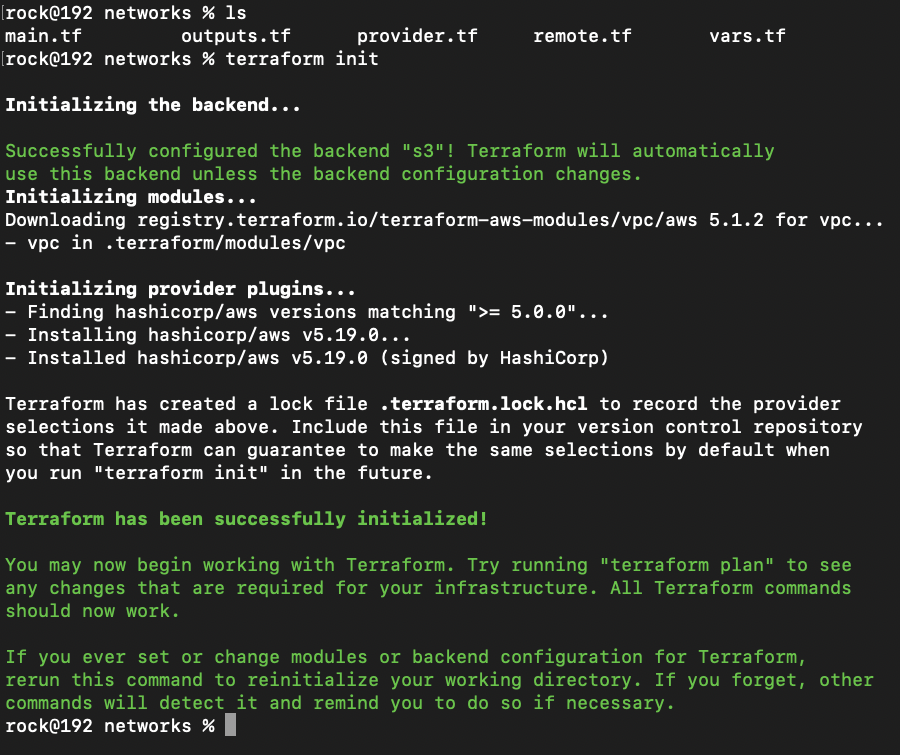

# vcare-test-terraform

**STEPS TO CREATE THIS WHOLE PROJECT**

firstly create 2 folder one for networks and another is for other AWS resources..

**Steps:-1** Go to VPC folder which includes VPC section, and lauch vpc with these commands:-

```
terraform init 
```



```
terraform plan
```

```
terraform apply
```


**Steps:-2**  Then go to other-resources folder >> route53, then apply the same tf commands:-


```
terraform init 
```

```
terraform plan
```

```
terraform apply
```


**Steps:-3** Then go to Others folder >> ecs-and-ecr then apply the same tf commands:-


```
terraform init 
```
But this time we use -out parameter

```
terraform plan  -out plan.out
```

```
terraform apply plan.out 

```

# FOR CI/CD PIPELINE AND SONARQUBE

Here i created 2 ec2 server one for sonarqube and 2nd for jenkins-server

then i installed sonarqube with docker-compose and install jenkins for CI/CD


